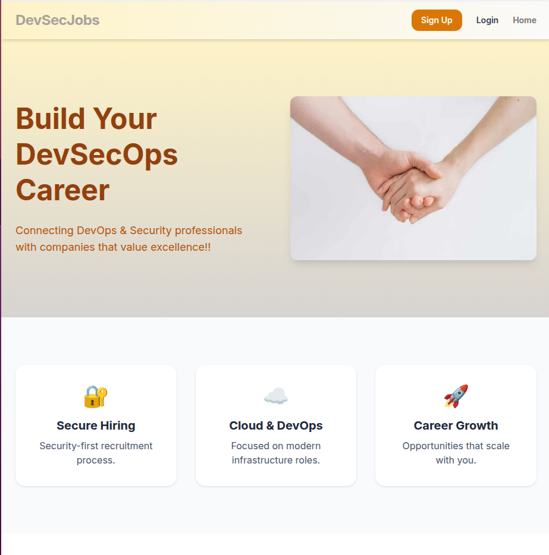
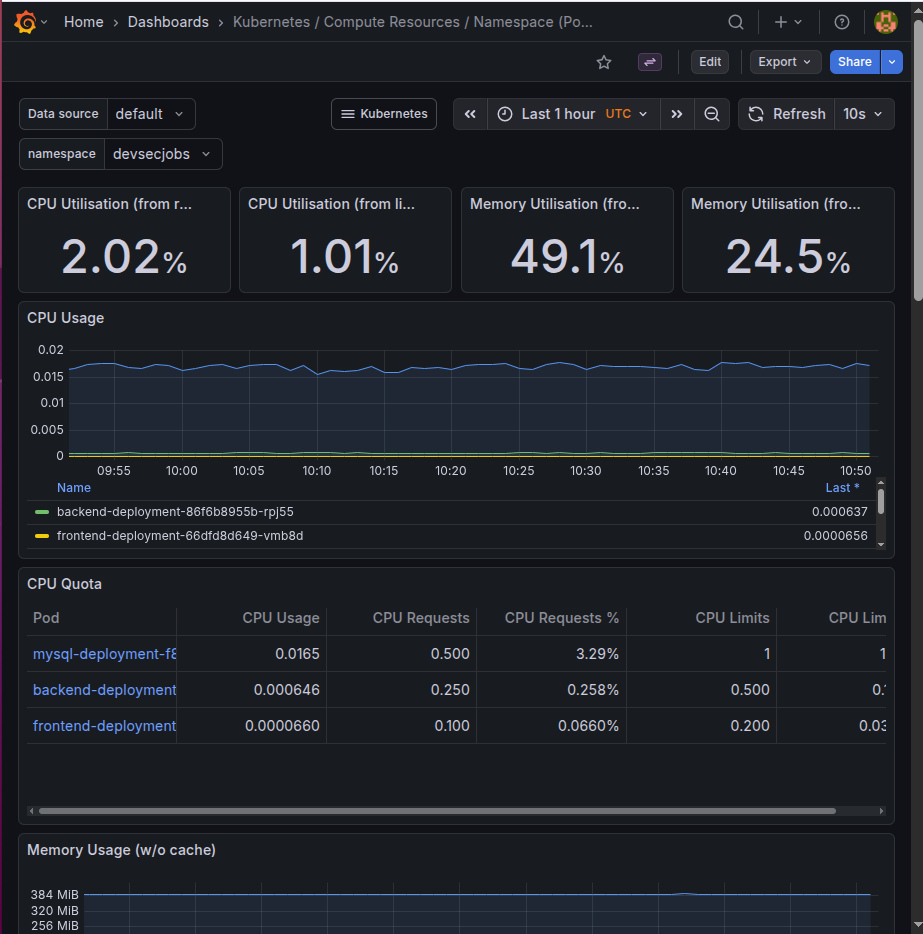

# DevSecJobs — Full‑Stack DevSecOps Job Platform 

A production‑style, cloud‑native project that demonstrates **end‑to‑end delivery**:  
**code → build → push → deploy → observe**, running on **AWS EKS** with **Terraform**, **Kubernetes**, **Docker**, **Jenkins**, and **Prometheus/Grafana**.

> **Live Demo**  
```txt
http://k8s-devsecjo-devsecjo-8cd4d7c18e-849609165.us-east-1.elb.amazonaws.com/
```

---

## Why this project matters (for recruiters)

This repository showcases practical DevSecOps skills:
- Designing a **containerized micro‑stack** (frontend, backend, database)
- Deploying and operating it on **Kubernetes (EKS)**
- Managing infrastructure with **Terraform (IaC)**
- Automating delivery with **Jenkins CI/CD**
- Operating with **observability** (Prometheus + Grafana dashboards)

---

## What the system does

**DevSecJobs** is a job platform focused on DevOps/Security roles.

### Frontend
- **React (Vite)** client application
- Auth pages (Sign Up / Login), navigation, and user flows
- Served as a static site from an **Nginx** container (multi‑stage Docker build)

### Backend
- **Python Flask** REST API
- Authentication with **JWT**
- CRUD endpoints for jobs & applications
- Health endpoint for monitoring and K8s probes

### Database
- **MySQL** as the primary data store
- Kubernetes persistent storage (PVC) for stateful data

---

## Tech Stack

### Application
- **Frontend:** React + Vite, Nginx (container runtime)
- **Backend:** Python Flask (REST), JWT auth
- **Database:** MySQL

### DevOps / Cloud
- **Docker** — container images (frontend/backend/mysql)
- **Kubernetes** — Deployments, Services, Ingress, Secrets/ConfigMaps, PVC
- **AWS EKS** — managed Kubernetes cluster
- **AWS ECR** — container registry
- **AWS ALB (Ingress Controller)** — external traffic routing to services
- **Terraform** — Infrastructure as Code (EKS, Jenkins, Monitoring)
- **Jenkins** — CI/CD pipeline orchestration
- **Monitoring:** Prometheus + Grafana (kube‑prometheus‑stack)

---

## CI/CD Overview (Jenkins)

Typical delivery flow:
1. **Git push** triggers the Jenkins pipeline
2. Jenkins builds Docker images (frontend/backend)
3. Images are pushed to **Amazon ECR**
4. Kubernetes Deployments are updated (rolling update)
5. New Pods become ready (readiness/liveness probes)
6. Observability dashboards reflect the updated workloads

✅ Result: fast and repeatable deployments with minimal downtime.

---

## Cloud Architecture (high level)

```txt
            ┌──────────────┐
            │   GitHub      │
            └──────┬───────┘
                   │ (push)
                   ▼
            ┌──────────────┐
            │   Jenkins     │
            │  CI/CD        │
            └──────┬───────┘
                   │ build + push
                   ▼
            ┌──────────────┐
            │   AWS ECR     │
            └──────┬───────┘
                   │ deploy/update
                   ▼
   ┌────────────────────────────────────┐
   │              AWS EKS               │
   │  ┌──────────┐  ┌──────────┐       │
   │  │ Frontend │  │ Backend  │       │
   │  └────┬─────┘  └────┬─────┘       │
   │       │             │             │
   │       ▼             ▼             │
   │    (Service)     (Service)        │
   │       │             │             │
   │       └──────┬──────┘             │
   │              ▼                    │
   │        ALB Ingress (HTTP)         │
   └────────────────────────────────────┘

            Observability:
            Prometheus scrapes metrics
            Grafana visualizes dashboards
```

---

## Kubernetes Highlights

- Dedicated namespace for the application (clean isolation)
- Deployments + Services for frontend, backend, and mysql
- **Ingress (ALB)** routes:
  - `/` → Frontend
  - API paths (e.g., `/auth`, `/jobs`, `/apply`, `/health`) → Backend
- **Health probes** and controlled rollouts for stability
- **Persistent Volume Claim** for MySQL data durability

---

## Monitoring (Prometheus + Grafana)

Monitoring is installed via Terraform + Helm (kube‑prometheus‑stack), providing:
- Cluster / Node metrics
- Pod CPU/memory usage
- Network throughput dashboards
- Namespace filtering (e.g., `devsecjobs`)

---

## Repository Structure

```txt
FrontEnd/                  # React (Vite) app + Dockerfile (Nginx)
Backend/                   # Flask API + Dockerfile
Devops/
  k8s/                     # Kubernetes manifests (deployments/services/ingress)
  tf/
    eks/                   # Terraform for EKS infrastructure
    jenkins/               # Terraform for Jenkins host (EC2 + bootstrap)
    monitoring/            # Terraform + Helm for Prometheus/Grafana
```

---

## Screenshots (recommended)

**Yes — screenshots are worth it** *if you keep it minimal and professional*:
- ✅ 1 screenshot of the **Home page**
- ✅ 1 screenshot of **Grafana (namespace dashboard)**

That’s not “too flashy”; it demonstrates **real operational visibility** (a big plus in interviews).

Suggested layout:
- Put images under: `docs/images/`
- Embed here:

```md
## Screenshots

### Application UI


### Observability (Grafana)

```

---

## Security Notes (next steps / roadmap)

This repo already demonstrates strong foundations. Future hardening ideas:
- HTTPS + domain: **Route53 + ACM**
- Secrets management: **AWS Secrets Manager** or External Secrets Operator
- Image scanning: **Trivy** / ECR scanning
- Runtime policy & guardrails: **OPA Gatekeeper / Kyverno**
- Autoscaling: **HPA** + resource tuning

---

## Developed by

Nerya Reznickovich
Yuval Mashiach 
Shay Rachamim
